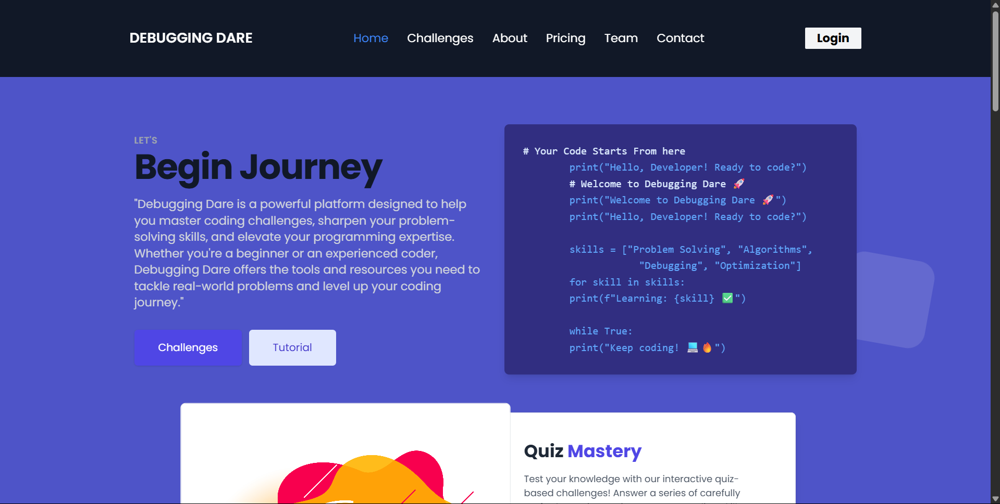
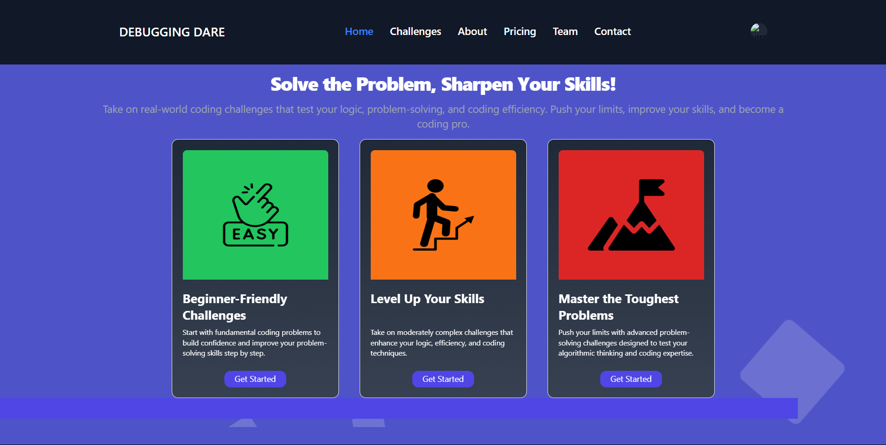
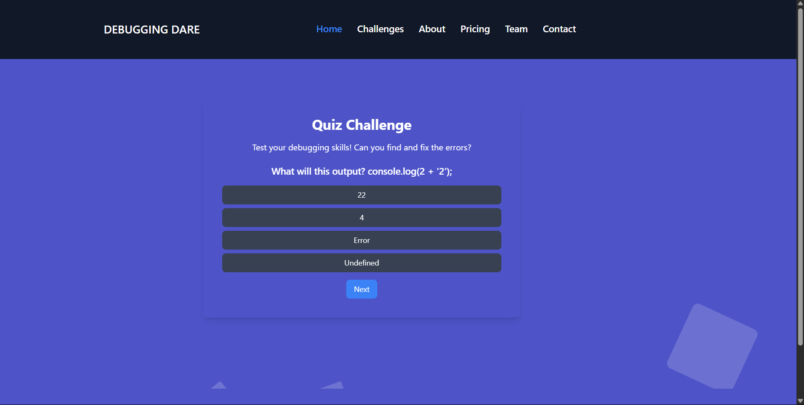
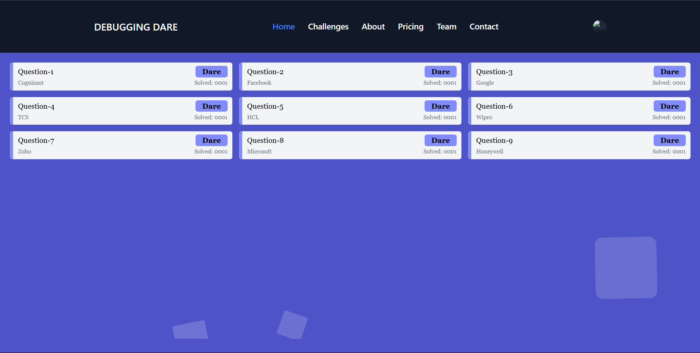

# Debugging Dare

Debugging DARE is a web platform that provides an IDE-based debugging environment. The platform is designed to help users learn, test, and debug code directly in the browser, supporting multiple programming languages and an intuitive interface. Built using Django for page rendering and HTML + Tailwind CSS for the frontend.

##  Screenshots
 
 

##  Author

**Gayathri G**  

